# Link - The Faces Of Evil

## Images (Backgrounds)

Images can be found by searching for the IDAT header bytes - 0x49 0x44 0x41 0x54

The 4 bytes following this e.g `0x00 0x04 0xba 0x00` (decimal 1080) indicate the width of the image, to get the actual size, we need to add to this `24 * c`, where c is equal to `image_width / 360`. 

The image itself, can then be found at an offset of 0x67c from the start of the IDAT header.

### ldata.rtr

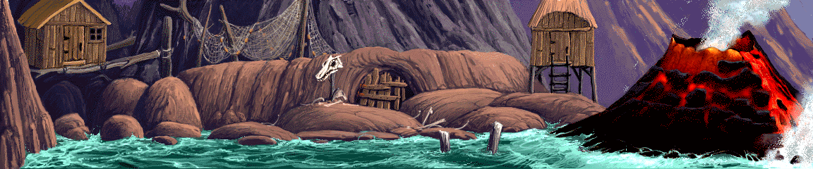

## Palettes

Palettes can be found in lanim.rtr, and ldata.rtr. The easiest method I've found is to strip the files of the CD-i sync, header, sub-header and any error-correction bytes, then scan for the byte sequence 0x00 0x00 0x00 0x80 0xFF 0xFF 0xFF. The palettes start with the 3 0xFF bytes and continues for 0x180/0x188 bytes.

### lanim.rtr

Contains 7 palettes, 3 of which appear to be duplicates.

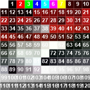
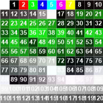

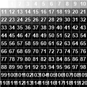
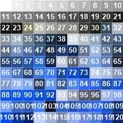

### ldata.rtr

Contains 72 palettes, of which there again appear to be some duplicates

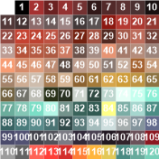
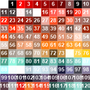
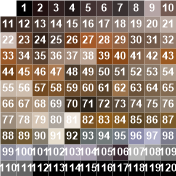
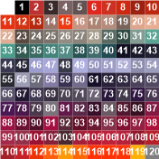

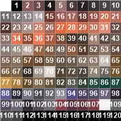
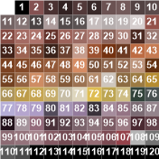
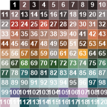
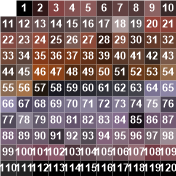

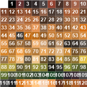
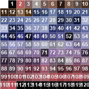
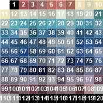
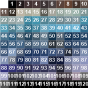

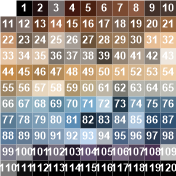
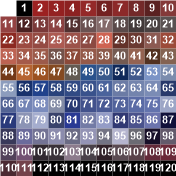
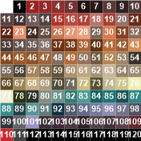
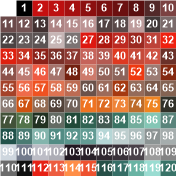

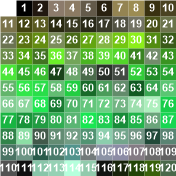
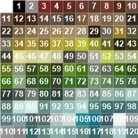
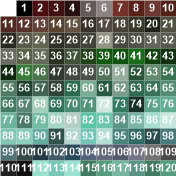
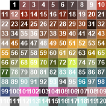

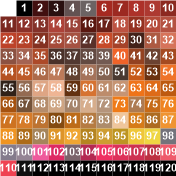
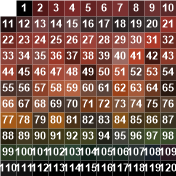
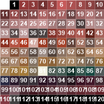
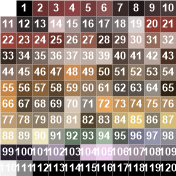

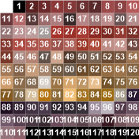
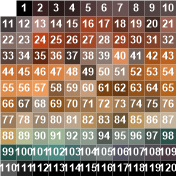
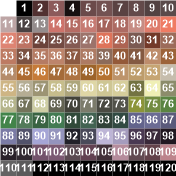
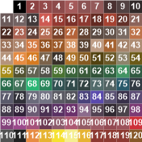

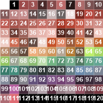
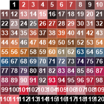
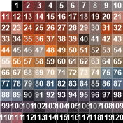
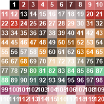

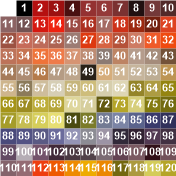
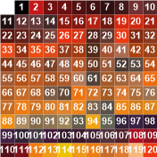
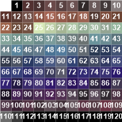
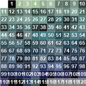

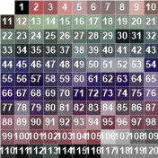
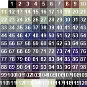
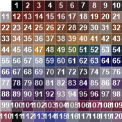
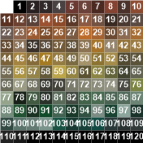

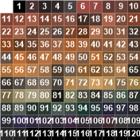
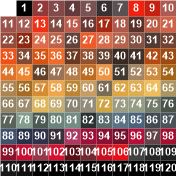
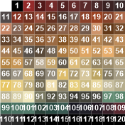
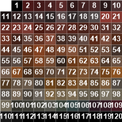

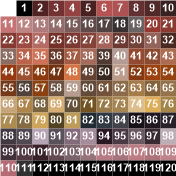

