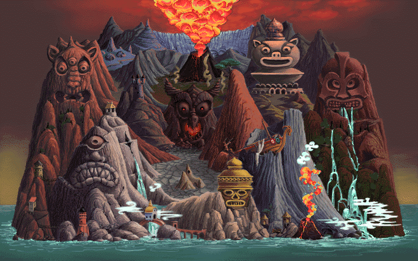
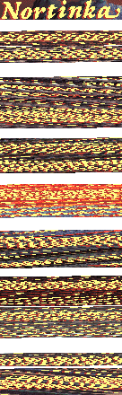
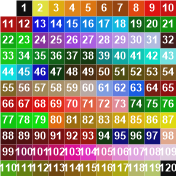
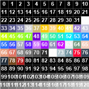
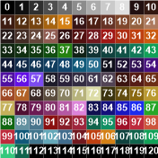
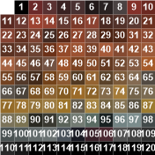

# Link - The Faces Of Evil

## Images (Backgrounds)

Images can be found by searching for the IDAT header bytes - 0x49 0x44 0x41 0x54

### ldata.rtr

Generally, the 4 bytes following this, e.g `0x00 0x04 0x38 0x00` (decimal 1080) indicate the width of the image. But to get the actual size, we need to add to this `24 * c`, where c is equal to `image_width / 360`. Annoyingly, the first image claims to have a size of 1210, but actually has a width of 704, which clearly doesn't fit this pattern.

#### ldata main image 1:

The image itself, can then be found at an offset of 0x67c from the start of the IDAT header. Any further images which share the palette will follow the previous one after a a gap of 0x678 * 0x00 bytes but do not share the dimensions of the initial image.

In the case of ldata.rtr, following the main image which contains the map screen, are a series of images for the map labels, these as mentioned do not share the original images' width of 704, and thus, require some manual tweaking to get the correct result.

As you can see below, only the first label image has the correct size, in this instance the label has a width of 136 pixels.

#### ldata label images:

ldata label image sizes | 
---------|
84|
92|
96|
100|
104|
112|
120|
124|
132|
136|
148|
156|

#### ldata main image 2:

## Palettes

Palettes can be found in lanim.rtr, and ldata.rtr. Again, these can be found by searching for the IDAT header bytes, but this time, the palette will be the 0x180 bytes preceding the start of the IDAT header.

Also in ldata.rtr are some CLUT palettes, which can be found by searching for 0xC3 0x00 0x00 and one of (0x00, 0x01,0x02,0x03) and taking the following 0x100 bytes

### lanim.rtr

Contains 7 unindexed palettes, 3 of which appear to be duplicates.

### ldata.rtr

Contains 6 indexed palettes, which need to be grouped in pairs to form 3 palettes

Contains 72 unindexed palettes, of which there again appear to be some duplicates

